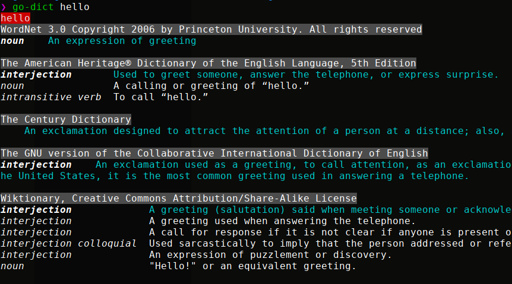

# go-dict
`go-dict` is a commandline tool to lookup words in the commandline.
Here is some example output (cropped):


## Install
```
go get -v github.com/makeworld-the-better-one/go-dict
```

## Usage
```
go-dict [word...]
```
Multiple words can be specified, separated by spaces.

## Improvements
- Support for other websites
- Etymology support
- Fix alignment across different dictionaries

## License
This code is licensed under the GPLv3. For more info, see the [LICENSE](./LICENSE) file.
